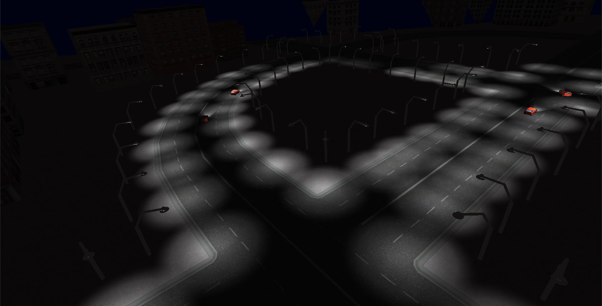
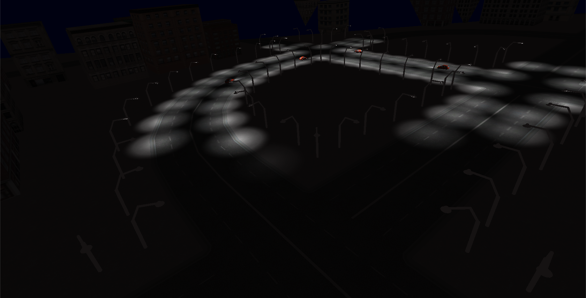
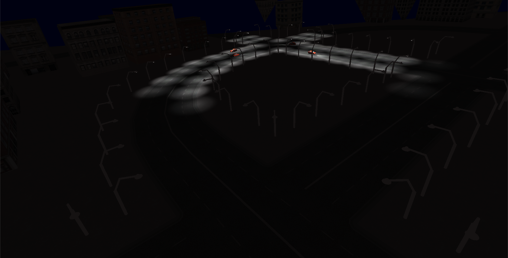

SmartStreetLights
=================

University Project

### Assets
----------

- Street lights and scripts to make stuff "smart" by the team behind SmartStreetLights

### Credits:

- **Modular Street City** by James Arndt (http://www.youtube.com/watch?v=IiXrnBp17K0)
- **Cars** from: http://www.youtube.com/watch?v=EINyakIB13E
- **Paths** for the car movements via iTween and iTweenPath (http://itween.pixelplacement.com/index.php)

### What it looks like
Lights will dim up and down as cars drive by.

### CHANGES
-----------
###### 0.0.3 - 16.01.2014
- introduced feature meassure on time of a street light.
- new builds for OS X, Windows and Web.

###### 0.0.2 - 03.01.2014
- added different scenes
- GUI now fades in/out after the mouse has not moved for a certain time.

###### 0.0.1
- Pre-release. This release is not considered to be rock solid.

